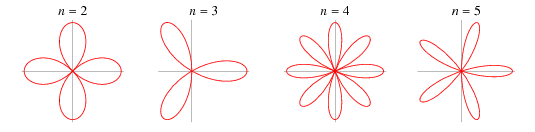

.. title: Trigonometry mat182
.. slug: mat182
.. date: 2016-01-17 08:53:43 UTC-07:00
.. tags: 
.. category: 
.. link: 
.. description: 
.. type: text

   image

Course Info
===========

Spring 2007

Course covers trigonometric functions, identities, graphs, vectors,
polar coordinates, complex numbers, coordinate system rotation, change
of basis, and conic sections.

-  `Syllabus <2007Spring.Syllabus.pdf>`__

Instructor Info
===============

-  Anthony Tanbakuchi
-  Office: Radiology Research Labs, U of A, (520) 626-4500
-  Easiest to contact me via email: kuchi@email.arizona.edu include
   "MAT182" in the subject.

Exam Solutions
==============

-  Test 1: `Exam <EXAM.2007Spring.1.pdf>`__,
   `Solutions <EXAM.2007Spring.1.Sol.pdf>`__
-  Test 2: `Exam <EXAM.2007Spring.2.pdf>`__,
   `Solutions <EXAM.2007Spring.2.Sol.pdf>`__
-  Test 3: `Exam <EXAM.2007Spring.3.pdf>`__,
   `Solutions <EXAM.2007Spring.3.Sol.pdf>`__
-  Final: `Exam <EXAM.2007Spring.Final.pdf>`__,
   `Solutions <EXAM.2007Spring.Final.Sol.pdf>`__
